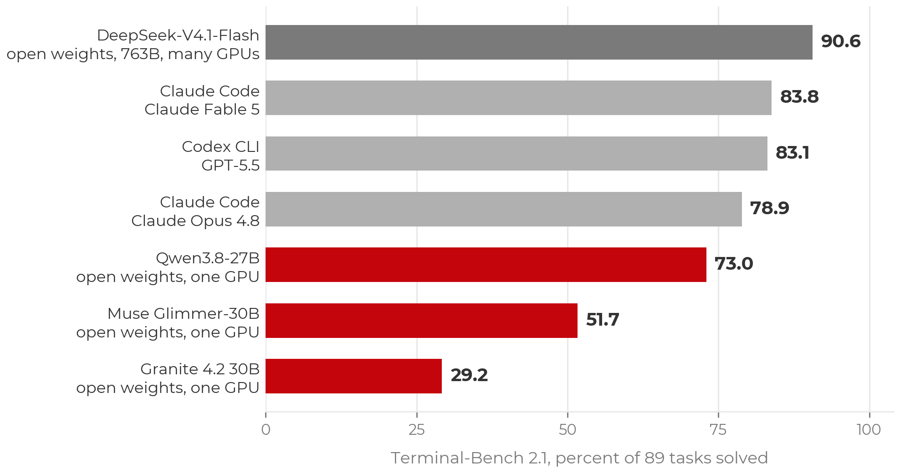

:::::::::::::::::::::::::::::::::::::: questions

- What distinguishes an agentic coding tool from autocomplete or a chat assistant?
- What is inside an agent, and what does the harness do that the model does not?
- Which tool should I pick, and how much does the choice matter?
- Is more autonomy better?

::::::::::::::::::::::::::::::::::::::::::::::::

::::::::::::::::::::::::::::::::::::: objectives

- Define agentic coding and contrast it with chat-based and autocomplete-based AI assistance.
- Describe an agent as a model plus a harness plus tools running an agent loop.
- Place a request on the spectrum of autonomy, from a single edit to a whole project.
- Explain why this lesson teaches principles rather than one tool.

::::::::::::::::::::::::::::::::::::::::::::::::

## Definition

**Agentic coding** is a software-development approach in which AI agents plan, write,
test, debug, and revise code with limited human intervention.

::::::::::::::::::::::::::::::::::::: callout

## The word "agent"

The term is now applied to many products that only have a chat interface, so it
needs a definition. In computer science an agent is a system that **takes actions**
in an environment and observes the results, in pursuit of a goal. A chatbot produces
text and the user acts on it. An agentic tool acts on its own: it edits files, runs
commands, reads the output, and decides what to do next. The distinguishing question
for any tool described as an agent is whether it acts or only advises. In agentic
coding the tool acts continuously, which is the source of both its usefulness and
its risk.

::::::::::::::::::::::::::::::::::::::::::::::::

An AI coding agent is a persistent, tool-enabled process driven by a large language
model. Earlier AI code assistants (the first GitHub Copilot, ChatGPT in a browser tab)
worked in a suggest-and-accept loop, with the user carrying context in and code out
and running everything by hand. An agent can instead:

- Read and navigate a codebase, rather than only the snippet it was given.
- Create and modify files, several at a time.
- Run terminal commands.
- Execute tests and inspect the failures directly.
- Search documentation.
- Develop and follow a plan.
- Iterate on its own work until the task is complete or it is blocked.

Typical requests include fixing a bug, adding a feature, refactoring existing code,
writing and running tests, reviewing a pull request, investigating a failing job, and
building a small application from a specification. The same capabilities give the
tool access to the user's files, shell, and any credentials left on disk, so an
unmanaged agent can do real damage. The balance between capability and control is the
subject of this lesson.

## The spectrum of autonomy

The same tool can be used at different levels of autonomy. Three requests, from
tightly directed to fully delegated:

1. "Write this for loop for me." One function; the user reads every line.
2. "Implement the method stubs in this file." A bounded task with a clear completion
   criterion; the agent does some planning and the user reviews the diff.
3. "Build the whole service from scratch; do all the planning yourself." The agent
   makes many decisions the user never considered, and the user reviews a project.

Across the three, **the more autonomy you grant, the more of your judgment must be
encoded in advance**, in the prompt, in project context files, and in tests, and the
more review is required afterwards. This principle recurs throughout the lesson. Most
of the workshop concerns the middle of the spectrum: bounded tasks with a plan and a
check.

::::::::::::::::::::::::::::::::::::: callout

## More autonomy is not automatically better

A given task (add a utility function, write tests, open a pull request) can be done at
any point on this spectrum. Moving toward autonomy reduces interruptions during the
work and increases the review burden after it. The appropriate level depends on the
task:

- Sensitive work or an unfamiliar codebase: interactive, with guardrails. The
  interruptions are useful.
- A quick question, brainstorming, or explaining an error: plain chat is sufficient.
- A well-scoped, clearly described task in a repository with good tests: delegation
  works, because the specification and the tests carry the intent.

::::::::::::::::::::::::::::::::::::::::::::::::

## Inside an agent: model, harness, tools, loop

Many tools are now built for agentic coding, including Claude Code, Codex, GitHub
Copilot's agent mode, OpenCode, Cursor, and a growing number of open-source
harnesses. Most can use several underlying language models. Two components should be
distinguished:

- **The model** provides reasoning and code generation.
- **The harness** is the application around the model. It provides what the model
  needs to operate on a real codebase: file-system access, terminal and test
  execution, context management, planning and task tracking, tool integrations,
  memory, permission controls, and the loop that connects them.

The harness runs an **agent loop**: request, understand, plan, act, observe, revise,
repeat. On each turn the model decides what to do next, the harness executes it (edits
a file, runs the tests), and the result is added to the model's context. In summary:
**agent = LLM + harness + tools + agent loop.**

More advanced harnesses add an orchestrator–worker pattern, in which a primary agent
divides a larger problem into tasks and delegates them to subagents that work in
parallel on research, implementation, testing, and review. Multi-agent workflows
became common toward the end of 2025. They occupy the far end of the autonomy spectrum
and are the hardest to review.

## Choice of tool

As of September 2026 the leading agents are close in capability. On
[Terminal-Bench 2.1](https://www.tbench.ai/leaderboard/terminal-bench/2.1), a
benchmark of realistic command-line tasks, Claude Code and Codex score within about
a point of each other, and GitHub Copilot uses the same Claude and GPT models. The
harness affects the result (the same model scores differently in different agents),
but the gap between the leading commercial tools is small.

{alt='Horizontal bar chart of Terminal-Bench 2.1 scores, percent of 89 tasks solved. DeepSeek-V4.1-Flash, open weights at 763B parameters on many GPUs, 90.6. Claude Code with Claude Fable 5, 83.8. Codex CLI with GPT-5.5, 83.1. Claude Code with Claude Opus 4.8, 78.9. Open-weight models on one GPU, in red: Qwen3.8-27B 73.0, Muse Glimmer-30B 51.7, Granite 4.2 30B 29.2.'}

Open-weight models are a viable option and are improving. The top Terminal-Bench
score at the time of writing belongs to an open-weight model (DeepSeek V4.1 Flash),
but at several hundred billion parameters it requires a cluster. Open-weight models
that fit on a single GPU trail the frontier by tens of points. Closing that gap is an
active research problem, and running a model yourself raises trust questions covered
in the [trust](trust.md) episode.

A table of tools would be out of date within months. The
[setup page](../learners/setup.md) lists routes to a working agent, including free
ones (Copilot's education tier, OpenCode with free models) for participants without a
paid plan or workshop credits.

::::::::::::::::::::::::::::::::::::: callout

## GitLab and other hosts

Everything interactive in this lesson is host-agnostic. An agent working on a checkout
uses ordinary git, so GitHub, GitLab (including self-hosted), and Bitbucket behave the
same. Only the cloud-agent surfaces (assigning issues to agents, cloud sandboxes) are
GitHub-specific at present. Self-hosting the repository does not change where
inference runs: code still goes to the model provider, so the data-policy rules apply.

::::::::::::::::::::::::::::::::::::::::::::::::

## Demo: one project at three levels of autonomy

::::::::::::::::::::::::::::::::::::: instructor

Run this live with Claude Code in VS Code (or OpenCode) on the project the rest of the
workshop uses. Show three examples along the spectrum:

1. A tightly directed coding task: one function.
2. A task in which the agent creates and follows a plan: use plan mode first, then
   let it implement.
3. A more autonomous, multi-agent workflow: describe it, but do not run it live. It
   takes longer and its outcome varies between runs.

Ask participants whether anyone wants to describe something notable their agent has
done. The answers indicate the range of experience in the group.

::::::::::::::::::::::::::::::::::::::::::::::::

::::::::::::::::::::::::::::::::::::: challenge

## Exercise: Place your own work on the spectrum (5 minutes)

Consider the last time you used AI for anything code-related. Pasting an error into a
chatbot counts.

1. Where does that use sit on the spectrum: a directed edit, a bounded task with a
   plan, or a whole project?
2. Name one task in your current research where you would want more autonomy from an
   AI tool, and one where you would not. What distinguishes them?

Compare with a neighbor.

:::::::::::::::::::::::: solution

## Typical answers

Most researchers cluster at the chat end. The tasks people decline to delegate are
usually the ones whose results they would find hard to check (their core analysis),
rather than the ones that are hardest to do. That judgment is sound and is the central
theme of the lesson: the autonomy you can grant is limited by how well you can verify
the result.

:::::::::::::::::::::::::::::::::

::::::::::::::::::::::::::::::::::::::::::::::::

## Principles rather than one tool

Each practice in this lesson (limiting access, planning, specifying, verifying,
managing cost) applies unchanged to whichever tool you or your group uses, so the main
text is tool-agnostic. Where the mechanics differ (a command name, a mode toggle, a
settings page), episodes give the equivalents for the two tools workshop participants
most commonly have, **Claude Code** and **GitHub Copilot**. Other tools map
one-to-one onto the same concepts.

::::::::::::::::::::::::::::::::::::: keypoints

- Agentic coding: AI agents plan, write, test, debug, and revise code with limited human intervention. An agent acts; a chatbot advises.
- Agent = LLM + harness + tools + agent loop. The model reasons; the harness supplies files, a terminal, tests, permissions, and memory.
- Requests range from a single edit to a whole project. More autonomy shifts effort from approving actions to specifying intent in advance and reviewing results afterwards.
- The leading tools are within a point or two of each other. Use what you have access to, and learn the principles.

::::::::::::::::::::::::::::::::::::::::::::::::
