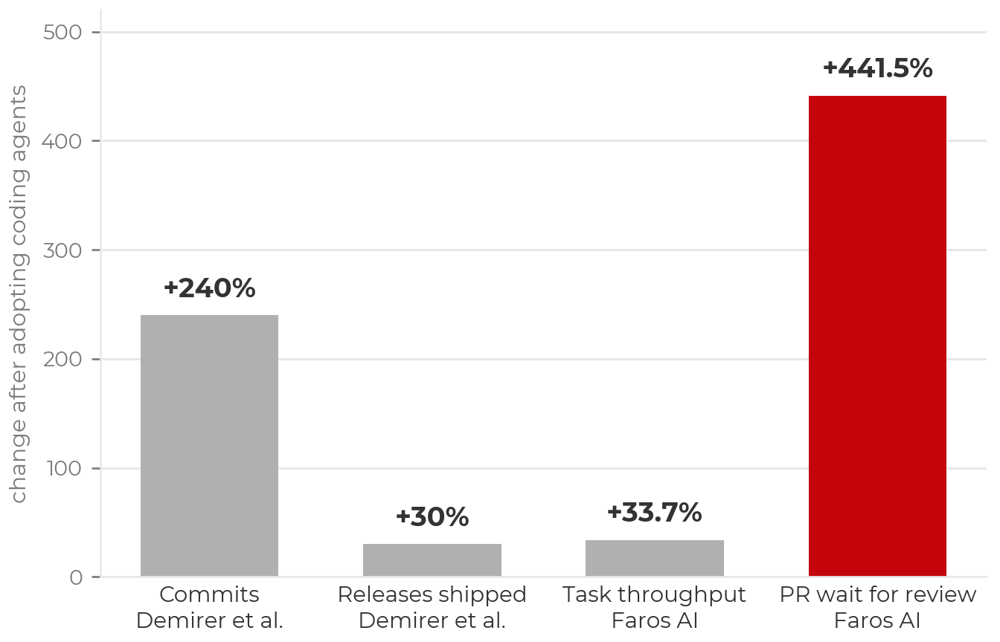

:::::::::::::::::::::::::::::::::::::: questions

- Why is "the code runs and the score is high" not sufficient?
- Which inexpensive checks catch expensive mistakes?
- How do I review an agent's work when the code runs?
- How can the agent help me reason about results, not only write code?
- How do I make checks run automatically so they are never skipped?

::::::::::::::::::::::::::::::::::::::::::::::::

::::::::::::::::::::::::::::::::::::: objectives

- Apply established data science verification practices (know your data, compare to a source of truth, ask a colleague, reproduce) to agent-generated analyses.
- Review an agent's diff by looking for decisions you did not make, and have the agent list its own assumptions.
- After each feature, have the agent propose and add tests, including edge cases, and run them before moving on.
- Make verification automatic: tests in CI and a protected `main`.
- Use an agent to reason over saved results and figures, and leave evidence in the repository for it to read.
- Run quick checks (label shuffling, baselines, overlap and duplicate checks, seed variation) that expose broken evaluations.
- Detect a group-leakage bug in code that runs cleanly and scores well, and write the assertion that catches it.

::::::::::::::::::::::::::::::::::::::::::::::::

## What the research shows about checking

Checking agent output is the bottleneck, not producing it:

- Agents multiply code written far more than code shipped: 240% more commits but only
  30% more releases across half a million GitHub developers (Demirer, Musolff & Yang,
  2026). Not all of the additional code is good code, and the gains attenuate at the
  human review step.
- Pull requests wait about five times longer for a human review under heavy AI use,
  and 31% more are merged without one (Faros AI telemetry, 22,000 developers, 2026).

{alt='Bar chart of percent change after adopting coding agents. Commits, Demirer et al.: plus 240 percent. Releases shipped, Demirer et al.: plus 30 percent. Task throughput, Faros AI: plus 33.7 percent. PR wait for review, Faros AI, in red: plus 441.5 percent.'}

The skill this episode teaches is the one in short supply.

## Look for decisions you did not make

When reviewing agent-written analysis code you are not checking syntax; the code
runs. You are looking for decisions. Do this after every feature, before the next
one: ask the agent for its assumptions, ask for tests and edge cases, run them, and
then move on. The places most likely to contain unexamined decisions:

- **Silently dropped or altered rows**: a default `dropna()`, an inner join that
  shrinks the table, a type coercion that turns errors into NaNs. Require row counts
  before and after every join and filter.
- **Defaults treated as decisions**: imputation strategy, class weights,
  regularization strength, thresholds. Every default the agent accepted is now a
  choice you are responsible for. This is one reason to start with an MVP small
  enough that you can own every choice in it.
- **Substituted metrics**: you asked about accuracy and the report features F1
  because the number was higher.
- **Suppressed problems**: warnings silenced, `try/except: pass`, an error "fixed" by
  deleting the check. An agent told to make the code run sometimes does exactly that.

One prompt worth adding to every review:

> Summarize every choice you made that I did not specify, and flag the risky ones.

It surfaces the dropped-row and default-parameter decisions above more reliably than
reading line by line.

:::::::::::::::::::::::::::::::::::: challenge

## Exercise 1: Test the feature you just built (10 minutes)

Start from feature 1, the one you implemented in the previous episode. This is the
step that follows every feature, before the next one begins.

1. **Ask for its assumptions and proposed tests**, in plan mode:

   > Read `plan.md` and the feature 1 code you just wrote.
   >
   > 1. List every choice you made that I did not specify, and flag the risky ones.
   > 2. Propose tests for this feature, including edge cases: empty input, wrong
   >    shape, duplicates, a sample that lands in both splits.
   > 3. Say which three matter most and why.
   >
   > Do not edit anything yet.

2. **Select the tests that matter.** Let the agent propose more than you would;
   keep the ones that protect against a wrong result.
3. **Have it add them and run `pytest`.** Fix what fails, then commit.
4. **Make it automatic.** A workflow runs `pytest` on every push
   ([GitHub Actions for Python](https://docs.github.com/en/actions/use-cases-and-examples/building-and-testing/building-and-testing-python));
   ask the agent to write it. Protect `main` so that a failing check blocks the merge
   ([about protected branches](https://docs.github.com/en/repositories/configuring-branches-and-merges-in-your-repository/managing-protected-branches/about-protected-branches)).

:::::::::::::::: group-tab

### Claude Code

Plan mode for step 1 (<kbd>Shift</kbd>+<kbd>Tab</kbd> locally; on the web, the "do
not edit" line has the same effect). For steps 3 and 4 switch to normal mode. Claude
will run `pytest` itself (approve the command) and iterate until it passes.

### GitHub Copilot

**Ask** mode with `@workspace` for step 1; **Agent** mode for steps 3 and 4. Copilot
proposes the `pytest` run in the terminal and waits for approval. The Actions workflow
and branch protection are configured on GitHub, not in the editor.

::::::::::::::::::::::::

:::::::::::::::::::::::: solution

## Why this works

A methodological requirement that was previously implicit is now an executable
contract. The agent has a feedback loop that fails when it reaches for the
average-case pattern, and you have an artifact that continues to protect the project
on every future change, whether the next edit comes from an agent, a colleague, or
you in six months. With CI and a protected `main`, the check cannot be forgotten.

One caution: an agent asked to "add tests" for existing code will often write tests
that assert whatever the code currently does, which preserves bugs rather than
catching them. That is why step 1 asks for assumptions and risks before asking for
tests. You decide what must be true; the agent writes the repetitive parts; you
review the tests with the same care as the implementation.

:::::::::::::::::::::::::::::::::

::::::::::::::::::::::::::::::::::::::::::::::::

## No escaping good data science

Research computing already had an answer to "how do I know this analysis is correct?"
before AI tools existed:

- **Know your data.** Distributions, outliers, units, missingness, class balance.
  Look at the rows.
- **Compare to a source of truth.** A published baseline, a hand-computed subset, a
  control.
- **Ask a colleague.** "Does this number seem plausible to you?"
- **Know what your model is responding to.** If the strongest predictor makes no
  scientific sense, that is a finding about the pipeline, not about the phenomenon.
- **Reproduce the result.** Rerun it, change the seed, rerun on a fresh split. If it
  does not hold, something you are not controlling is driving it.

None of this has changed. Only the typing, and some quick ideation, has moved to the agent. What has changed is
speed: a plausible, clean-running, well-scoring analysis can now be produced in
minutes, which means you can be misled in minutes as well. The checking has to keep
pace. Agents can learn more about your project as you leave evidence in the
repository (figures, metrics, notes), but they see a portion of the project at a
time, never all of it.

## Agents as data science assistants

Verification is not only about finding bugs. The agent is also a fast second reader
of your results, if it is given something to read.

- **Ask it to reason over results, not only to write code.** What stands out, what
  disagrees, what to try next.
- **Leave evidence in the repository.** Metrics files, figures, run logs, a
  `results.md`. What is not written down does not exist for the agent.
- **Direct it to the evidence each time.** It does not remember the previous session
  and will not open a file you did not name.
- **It reads plots.** A saved figure is context.
- **Iterate faster.** Get the result and examine it, rather than debugging convoluted
  code late at night. Check as you go.
- **It does not replace your own reading.** Check every number it cites against the
  file. It sees a portion of the project, never all of it.

> Read `results/feature1_metrics.json`, `figures/cv_by_fold.png` and `plan.md`.
> What stands out? Which fold or class is driving the average, and does the plot
> agree with the numbers? Propose the one experiment you would run next and say what
> result would change our plan. Do not run anything yet.

## Quick checks that catch common mistakes

A small set of checks, each a few lines, exposes whole classes of silent failure. The
agent can implement any of them quickly if asked:

- **Shuffle the labels and rerun.** A sound pipeline collapses to chance. If it does
  not, information is leaking.
- **Print the baseline.** 94% accuracy is not impressive when the majority class is
  92% of the data.
- **Assert that no sample appears in both splits.** Repeated measures and tiles from
  one image belong on one side.
- **Find duplicates before splitting.** Duplicates across the split are leakage with
  no code bug.
- **Vary the seed.** A metric that moves substantially across seeds is a variance
  problem, not a result.

::::::::::::::::::::::::::::::::::::: challenge

## Exercise 2: What is wrong with this? (5 minutes)

```python
# Brain decoding. 20 subjects, 400 trials each,
# one EEG window per trial.
X, y, subject = load_windows()      # X: (8000, ch, t)

X_train, X_test, y_train, y_test = train_test_split(
    X, y, test_size=0.2, random_state=42)

clf = make_pipeline(StandardScaler(), LogisticRegression())
clf.fit(X_train.reshape(len(X_train), -1), y_train)
print("accuracy", clf.score(
    X_test.reshape(len(X_test), -1), y_test))
# accuracy 0.91
```

The code runs. The number is high. Find the bug. Then write the one assertion that
would have caught it.

:::::::::::::::::::::::: solution

## The bug, and the assertion that catches it

Every subject appears in both splits. The model learned to identify each person, not
what they were looking at. On a new subject the score drops:

```python
X, y, subject = load_windows()   # subject: one ID per trial
from sklearn.model_selection import GroupShuffleSplit

train_idx, test_idx = next(GroupShuffleSplit(
    test_size=0.2, random_state=42).split(X, y, groups=subject))
assert set(subject[train_idx]).isdisjoint(subject[test_idx])
# accuracy on unseen subjects: 0.58
```

Split by the unit that repeats, and assert it: subject in a brain-decoding study,
camera burst in a wildlife-camera dataset, page in a document-transcription task,
source document in a retrieval pipeline. The assertion runs every time, so it is
never forgotten. Checks that must be remembered are eventually skipped.

If you did not find it, that is the usual outcome. Nothing in this code looks wrong,
no error is raised, and the score rewards not looking further. This is the
plausible-average-case failure from the previous episode: `train_test_split` is the
pattern in a million notebooks, and the agent optimized for apparent completion, a
clean run and a high score. If your review consists of "does it run, is the score
good", you and the agent have the same blind spot.

:::::::::::::::::::::::::::::::::

::::::::::::::::::::::::::::::::::::::::::::::::

## Autonomy is purchased with verification

The highest-leverage practice in agentic coding is to make verification executable.
Agents perform markedly better when they can check their own output by running
tests, comparing against known values, and validating properties, rather than relying
on you as the only feedback loop. Include test cases in the prompt. Point at symptoms
rather than fixes ("fix the root cause and verify; do not suppress the error"). For
analyses, require printed evidence. Tests are now inexpensive to write: ask for them
with every feature, ask for data-validation tests on the actual dataset (expected
columns, value ranges, unique identifiers, row counts across merges), and ask the
agent what inputs would break its own function.

The more trustworthy the checks, the more autonomy can safely be granted. Scale the
checking to the stakes, and choose the tier explicitly before starting:

| Tier | Example | Minimum verification |
|------|---------|----------------------|
| Throwaway | one-off plot, scratch script | Read the diff; inspect the output |
| Working code | lab-internal pipeline, reusable utilities | Tests pass in CI; you review the diff; data-property checks printed |
| Load-bearing | results in a paper, shared package, anything cited | All of the above, plus comparison to a source of truth and a second reviewer |

::::::::::::::::::::::::::::::::::::: keypoints

- Checking is the bottleneck. Agents multiply commits far more than releases, and unreviewed merges increase. Verification is the scarce skill.
- Established practice still applies: know your data, compare to a source of truth, ask a colleague, know what your model responds to, reproduce the result. Only the typing and quick ideation have moved.
- Quick checks catch common mistakes: shuffle labels, print the baseline, assert no sample is in both splits, find duplicates, vary the seed.
- Split by the unit that repeats, and assert it. A clean-running 0.91 can be 0.58 on unseen subjects.
- After every feature, before the next: have the agent list its assumptions, propose tests and edge cases, add them, and run them. Then commit.
- Make verification automatic: tests in CI and a protected `main`. Autonomy is purchased with verification.
- Leave evidence in the repository and direct the agent to it. It reads figures and metrics, but only those you name, and you check every number it cites.

::::::::::::::::::::::::::::::::::::::::::::::::
